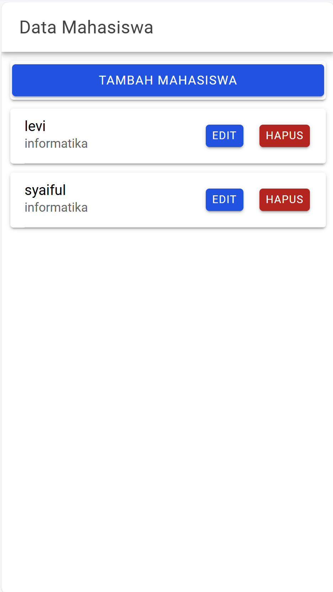
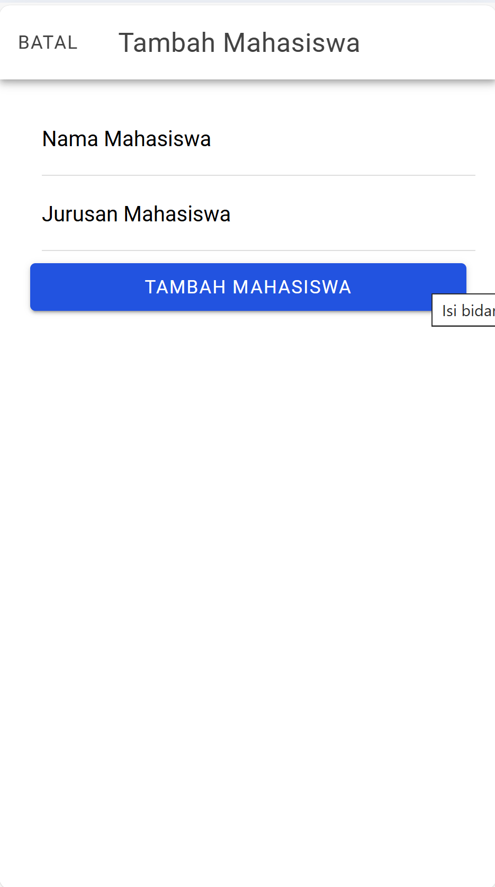
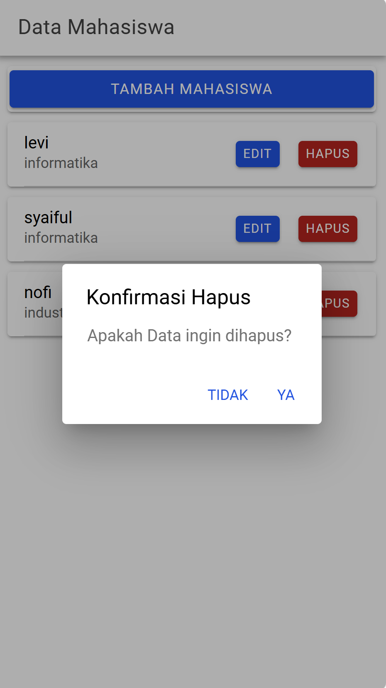
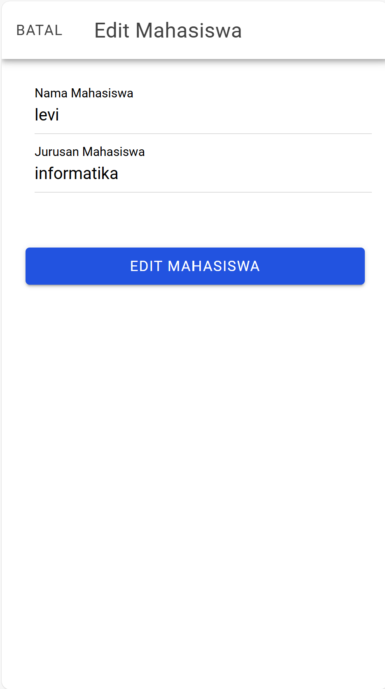

# Tugas 8 Pertemuan 9 - Proyek Ionic

**Nama:** Muhammad Levi Asshidiqi  
**NIM:** H1D022103  
**Shift Baru:** A  

Buatlah repository github serta upload Source Code ke repository

Masukkan SS semua proses CRUD ke dalam Readme.md lalu jelaskan semua SS dibawah setiap gambar CRUD. Kelengkapan proses menentukan penilaian

Nama : Muhammad Levi Asshidiqi

NIM : H1D022103

Shift Baru: A

  

1. Di komponen Angular (MahasiswaPage), ada metode getMahasiswa().

2. Saat ngOnInit() dipanggil (komponen baru dibuka), getMahasiswa() mengirim permintaan GET ke tampil.php untuk mengambil semua data mahasiswa.

3. tampil.php pada backend mengeksekusi query SQL SELECT * FROM mahasiswa, mengambil data mahasiswa, dan mengirimkan hasilnya sebagai JSON.

4. Komponen MahasiswaPage menerima data JSON dan menyimpannya di variabel dataMahasiswa untuk ditampilkan pada halaman.

1. Pengguna mengklik tombol Tambah Mahasiswa di halaman, yang membuka modal input.

2. Pada modal, pengguna mengisi data Nama Mahasiswa dan Jurusan lalu menekan tombol Tambah Mahasiswa.

3. Metode tambahMahasiswa() di komponen MahasiswaPage mengambil data dari input, membuat objek, dan mengirimkan permintaan POST ke tambah.php dengan data tersebut.

4. tambah.php menerima data JSON, mengeksekusi query INSERT untuk menambahkan data baru ke database, dan mengembalikan status sukses atau gagal sebagai JSON.

5. Jika berhasil, modal input ditutup, getMahasiswa() dipanggil kembali untuk memperbarui daftar, dan pengguna melihat data yang baru saja ditambahkan.

1. Pengguna mengklik tombol Hapus di samping data mahasiswa yang ingin dihapus.

2. Metode hapusMahasiswa() di komponen MahasiswaPage menampilkan AlertController konfirmasi. Jika pengguna memilih "Ya," proses dilanjutkan; jika memilih "Tidak," proses dibatalkan.

3. Jika pengguna memilih "Ya," hapusMahasiswa() mengirim permintaan DELETE atau GET dengan id ke hapus.php.

4. hapus.php mengeksekusi query DELETE untuk menghapus data mahasiswa berdasarkan id yang diterima dan mengembalikan status.

5. Jika berhasil, getMahasiswa() dipanggil kembali untuk memperbarui daftar, dan pengguna melihat data mahasiswa telah terhapus dari daftar.

1. Pengguna mengklik tombol Edit di samping data mahasiswa yang ingin diubah.

2. Modal edit terbuka, menampilkan data Nama Mahasiswa dan Jurusan yang ada. Komponen memanggil ambilMahasiswa() untuk mengambil detail mahasiswa spesifik dari database.

3. Pengguna mengubah data yang diperlukan dan menekan tombol Edit Mahasiswa.

4. Metode editMahasiswa() di komponen MahasiswaPage membuat objek dari data yang diperbarui dan mengirimkannya sebagai permintaan PUT atau POST ke edit.php.

5. edit.php menerima data JSON, menjalankan query UPDATE untuk memperbarui data mahasiswa berdasarkan id, dan mengembalikan status sukses atau gagal.

6. Jika berhasil, modal ditutup, getMahasiswa() dipanggil kembali untuk memperbarui daftar, dan pengguna melihat data yang telah diperbarui.
